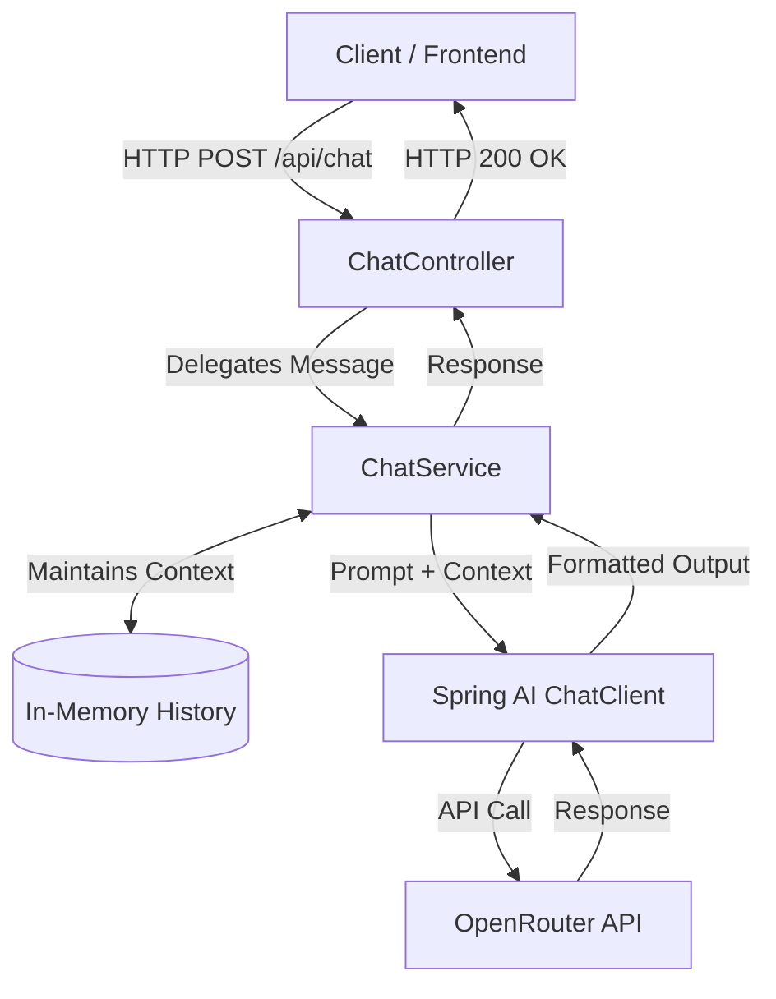

<div align="center">
  <h1>Snippit AI Chatbot Backend</h1>
  <p><i>An intelligent, context-aware customer support assistant for Snippit</i></p>
  
  <p>
    <a href="https://java.com/"></a>
    <a href="https://spring.io/projects/spring-boot"></a>
    <a href="https://spring.io/projects/spring-ai"></a>
    <a href="https://openrouter.ai/"></a>
  </p>
</div>

<br/>

Welcome to the backend service for **Snippit AI**! This application serves as a professional and friendly customer-support assistant for the **Snippit** quick-commerce application. 

Powered by **Java**, **Spring Boot**, and **Spring AI**, it leverages **OpenRouter's API** to access powerful, free-tier Large Language Models (LLMs). This setup provides intelligent, context-aware responses regarding order tracking, deliveries, cancellations, refunds, payments, and company policies—all without the overhead of paid API keys.

---

## ✨ Key Features

- **💬 Conversational AI:** Maintains chat history per session to provide highly contextual and coherent answers.
- **🛡️ Strict Guardrails:** The AI is strictly instructed via system prompts to *only* answer questions related to the Snippit application. It acts as a dedicated support agent and will safely reject off-topic questions (e.g., coding, general knowledge).
- **💸 Free LLM Access:** Configured to use OpenRouter's API, enabling access to high-quality open-source and free-tier models without requiring a credit card.
- **🚀 RESTful Endpoints:** Clean, simple, and easy-to-integrate API endpoints for seamless frontend consumption.
- **🧠 Spring AI Integration:** Built on top of the robust Spring AI framework, making LLM interactions declarative, scalable, and highly maintainable.

---

## 🛠️ Tech Stack

| Technology | Description |
| :--- | :--- |
| **Java 25** | Core programming language |
| **Spring Boot 4.1.1** | Application framework and REST API engine |
| **Spring AI 2.0.1** | Modern AI framework for seamless integration with LLMs via OpenRouter |
| **Maven** | Dependency management and build tool |

---

## 🏗️ Architecture & High-Level Design (HLD)

This project avoids raw HTTP calls by utilizing the **Spring AI** framework's standardized abstractions. It is seamlessly connected to **OpenRouter**, which routes the requests to the designated LLM.



1. **Spring AI Starter:** Uses `spring-ai-starter-model-openai` (compatible with OpenRouter's OpenAI-compliant API format).
2. **ChatClient Integration:** Configures system prompts and conversational context natively.
3. **Message Abstraction:** Conversational history is maintained using Spring AI's decoupled message types (`UserMessage`, `AssistantMessage`).

---

## 📁 Project Structure

```text
src
 └── main
     ├── java/com/maxx/chatbot
     │   ├── ChatbotApplication.java   # Main Spring Boot application entry point
     │   ├── controller
     │   │   └── ChatController.java   # REST endpoints (/api/chat)
     │   └── service
     │       └── ChatService.java      # Business logic & LLM system prompts
     └── resources
         └── application.properties    # Configuration file (ports, OpenRouter config)
```

---

## 📋 Prerequisites

Before you begin, ensure you have the following ready:
- **Java 25** (or compatible modern Java version) installed on your machine.
- An **OpenRouter API Key**. You can generate one for free at [OpenRouter.ai](https://openrouter.ai/). *No credits or payment methods are required to use their free-tier models.*

---

## ⚙️ Configuration

The application requires your OpenRouter API key to function. Set it as an environment variable in your terminal before running the app.

<details>
<summary><b>💻 Windows (Command Prompt)</b></summary>

```cmd
set OPENROUTER_API_KEY=your_api_key_here
```
</details>

<details>
<summary><b>💻 Windows (PowerShell)</b></summary>

```powershell
$env:OPENROUTER_API_KEY="your_api_key_here"
```
</details>

<details>
<summary><b>🍏 macOS / 🐧 Linux</b></summary>

```bash
export OPENROUTER_API_KEY="your_api_key_here"
```
</details>

> 💡 **Pro Tip:** For local development, you can create an `application-local.properties` file or simply add the key directly into your IDE's environment variables configurations.

---

## 🚀 Getting Started

You do not need Maven installed on your machine; the repository includes a self-contained Maven Wrapper (`mvnw`).

1. **Clone the repository:**
   ```bash
   git clone https://github.com/madebymaxx/snippit-ai-chatbot-backend.git
   cd snippit-ai-chatbot-backend
   ```

2. **Start the application:**

   **Windows:**
   ```powershell
   .\mvnw.cmd spring-boot:run
   ```

   **macOS / Linux:**
   ```bash
   ./mvnw spring-boot:run
   ```

3. **Verify the server:**
   Once running, the server will be available at: `http://localhost:8080`

---

## 📡 API Endpoints

### 1. Chat with the AI
Send a message to the chatbot. The backend automatically remembers the conversation context.

- **URL:** `/api/chat`
- **Method:** `POST`
- **Headers:** `Content-Type: text/plain`
- **Body:** `String` (The user's query)

**Example Request:**
```bash
curl -X POST http://localhost:8080/api/chat \
     -H "Content-Type: text/plain" \
     -d "Where is my order #12345?"
```

**Example Response:**
```text
Hello! I can help you with that. Let me check the status of order #12345 in our Snippit database.
```

### 2. Clear Chat History
Wipes the current conversation history. Useful for resetting the context.

- **URL:** `/api`
- **Method:** `DELETE`
- **Response:** `200 OK`

**Example Request:**
```bash
curl -X DELETE http://localhost:8080/api
```

---

## 🧪 Testing

To ensure everything is working correctly, you can run the provided unit and integration test suite:

**Windows:**
```powershell
.\mvnw.cmd test
```

**macOS / Linux:**
```bash
./mvnw test
```

---

## 👨‍💻 Developer / Author

**Max (Nikhil Singh)**
- **GitHub:** [@madebymaxx](https://github.com/madebymaxx)

